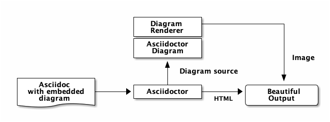

= Asciidoctor Diagram
Pepijn Van_Eeckhoudt <https://github.com/pepijnve[@pepijnve]>; Sarah White <https://github.com/graphitefriction[@graphitefriction]>
:description: README for the Asciidoctor Diagram extension for Asciidoctor.

image:https://github.com/asciidoctor/asciidoctor-diagram/workflows/Linux%20unit%20tests/badge.svg?branch=master["Linux Build Status", link="https://github.com/asciidoctor/asciidoctor-diagram/actions?query=workflow%3A%22Linux+unit+tests%22"]
image:https://github.com/asciidoctor/asciidoctor-diagram/workflows/macOS%20unit%20tests/badge.svg?branch=master["macOS Build Status", link="https://github.com/asciidoctor/asciidoctor-diagram/actions?query=workflow%3A%22macOS+unit+tests%22"]
image:https://github.com/asciidoctor/asciidoctor-diagram/workflows/Windows%20unit%20tests/badge.svg?branch=master["Windows Build Status", link="https://github.com/asciidoctor/asciidoctor-diagram/actions?query=workflow%3A%22Windows+unit+tests%22"]
image:https://badge.fury.io/rb/asciidoctor-diagram.svg[Gem Version, link=https://rubygems.org/gems/asciidoctor-diagram]

Asciidoctor Diagram is a set of Asciidoctor extensions that enable you to add diagrams, which you describe using plain text, to your AsciiDoc document.
The extension will run the appropriate diagram processor to generate an image from the input text.
The generated image is then inserted into your converted document.

As an example this enables you to embed a plain text diagram as a block in your document

---------
[ditaa]
----
              +-------------+
              | asciidoctor |-----------+
              |  diagram    |           |
              +-------------+           | image
                    ^                   |
                    | diagram source    |
                    |                   v
 +--------+   +-----+-------+    /---------------\
 |  adoc  |-->+ asciidoctor +    | HTML + image  |
 +--------+   +-------------+    \---------------/
----
---------

and get a rendered diagram in your output file.

Detailed usage instructions can be found on the https://docs.asciidoctor.org/diagram-extension/latest/[Asciidoctor documentation site].

Asciidoctor Diagram was inspired by the https://code.google.com/p/asciidoc-plantuml/[AsciiDoc PlantUML filter].